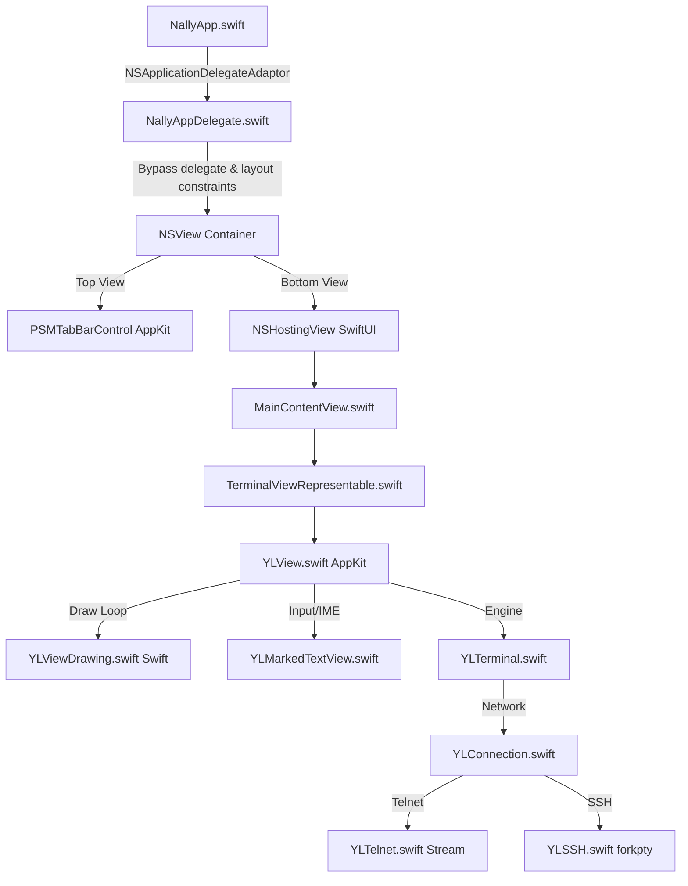

# Nally Unofficial 專案開發規格與架構說明書 (`NALLY_UNOFFICIAL_SPEC.md`)

## 1. 專案概述 (Project Overview)
Nally Unofficial 是一個開源的 macOS 終端機/BBS (Telnet/SSH) 用戶端程式。本專案的主要目標是將傳統基於 Objective-C、Nib/XIB 以及過時 Cocoa 繪圖與事件處理 API 的 Nally 移植至現代的 Apple Silicon (arm64) 架構，並逐步重構為基於 Swift 與 SwiftUI 的現代 macOS 應用程式。

目前主分支已成功完成 **Phase 1 到 Phase 5** 的重構與合併作業，建立了穩固的 Swift / SwiftUI 開發基礎。

---

## 2. 核心架構設計 (Core Architecture)

本專案採用 **AppKit 生命週期 + SwiftUI 視圖橋接** 的混編架構：



### 2.1 進入點與生命週期管理
* **[NallyApp.swift](file:///Users/ericsk/Projects/Nally-Unofficial/Code/NallyApp.swift)**: 應用程式的主進入點（`@main`），定義了基於 SwiftUI 結構的應用，並透過 `@NSApplicationDelegateAdaptor` 委派給傳統的 AppKit AppDelegate。
* **[NallyAppDelegate.swift](file:///Users/ericsk/Projects/Nally-Unofficial/Code/NallyAppDelegate.swift)**: 
  * 載入主選單的 Nib 資源 (`MainMenu.xib`)。
  * 自 Nib 取得主要邏輯控制器 `YLController`。
  * 程式化初始化視窗工具列 `NSToolbar` 並委派給 `NallyToolbarDelegate`。
  * 建立底層 AppKit 容器視圖，將純 AppKit 的分頁列元件 `PSMTabBarControl` 與由 `NSHostingView` 承載的 SwiftUI `MainContentView` 垂直拼接，巧妙解決了 SwiftUI 對非 Auto Layout 元件的佈局限制與委派物件型別檢查問題。

### 2.2 視圖與橋接層 (UI & Bridging Layer)
* **[MainContentView.swift](file:///Users/ericsk/Projects/Nally-Unofficial/Code/MainContentView.swift)**: 終端機主要介面的 SwiftUI 封裝，依據全域字型與行列設定動態計算終端機所需尺寸，並顯示 `TerminalViewRepresentable`。
* **[TerminalViewRepresentable.swift](file:///Users/ericsk/Projects/Nally-Unofficial/Code/TerminalViewRepresentable.swift)**: 實作 `NSViewRepresentable`，負責將 AppKit 的終端機顯示元件 `YLView` 橋接至 SwiftUI 視圖階層中。
* **[YLView.swift](file:///Users/ericsk/Projects/Nally-Unofficial/Code/YLView.swift)**: 終端機主要視圖元件。已完全轉換為純 Swift 實作，消除 C++ / Objective-C++ 混編。負責滑鼠事件、鍵盤輸入、右鍵選單管理以及 conform `NSTextInputClient` 協定。
* **[YLMarkedTextView.swift](file:///Users/ericsk/Projects/Nally-Unofficial/Code/YLMarkedTextView.swift)**: 專責處理輸入法 (IME) Marked Text 的繪製，保證輸入法彈出視窗與中文字元組裝的相容性與穩定性。

### 2.3 終端機模擬與資料結構 (Terminal Engine & Core Data Models)
* **[YLTerminal.swift](file:///Users/ericsk/Projects/Nally-Unofficial/Code/YLTerminal.swift)**: 終端機模擬核心。用 Swift 重新實作，負責解析 VT100 / VT102 與 ANSI 跳脫序列（Escape Sequences），管理雙位元組字元緩衝區、游標位置以及更新狀態。
* **[CommonType.swift](file:///Users/ericsk/Projects/Nally-Unofficial/Code/CommonType.swift)** (對應 **[CommonType.h](file:///Users/ericsk/Projects/Nally-Unofficial/Code/CommonType.h)** 與 **[CommonType.m](file:///Users/ericsk/Projects/Nally-Unofficial/Code/CommonType.m)**): 定義核心字元儲存結構 `cell` 及其對應的顯示屬性 `attribute` (如前景色、背景色、閃爍、粗體、雙位元組狀態等)。
* **[YLLGlobalConfig.swift](file:///Users/ericsk/Projects/Nally-Unofficial/Code/YLLGlobalConfig.swift)**: 使用現代 Swift 的 `@Observable` 機制重寫，管理全域設定、色彩對照表、CoreText 字型屬性（英文 Monaco / 中文 儷黑體等）。
* **[YLSite.swift](file:///Users/ericsk/Projects/Nally-Unofficial/Code/YLSite.swift)**: 使用 `@Observable` 的站台資料模型，包含站台名稱、連線位址、帳號密碼、預設編碼 (Big5/GBK) 及 ANSI 色彩鍵值設定。

### 2.4 網路通訊層 (Network Stack)
* **[YLConnection.swift](file:///Users/ericsk/Projects/Nally-Unofficial/Code/YLConnection.swift)**: 網路通訊協定抽象介面與連線工廠，根據位址字首自動分派 SSH 或 Telnet 連線物件。
* **[YLTelnet.swift](file:///Users/ericsk/Projects/Nally-Unofficial/Code/YLTelnet.swift)**: 實作 Telnet 連線，使用 Swift 重新實作之 Foundation `InputStream` / `OutputStream` 與執行迴圈 (RunLoop) 機制，並剖析 Telnet 選項協議 (WILL/WONT/DO/DONT)。
* **[YLSSH.swift](file:///Users/ericsk/Projects/Nally-Unofficial/Code/YLSSH.swift)**: 實作 SSH 連線。利用 POSIX `forkpty` 產生子程序執行 `/usr/bin/ssh`，透過 PTY 檔案描述子 (File Descriptor) 直接讀寫資料，實現輕量且高相容性的 SSH 支援。

### 2.5 繪圖與渲染引擎 (Rendering Engine)
* **[YLViewDrawing.swift](file:///Users/ericsk/Projects/Nally-Unofficial/Code/YLViewDrawing.swift)**: 透過 Swift 擴充 `YLView` 繪圖邏輯。使用 CoreGraphics / CoreText API 進行 GPU 加速字元渲染：
  * 解析 ANSI 色彩並套用對應的前景色與背景色。
  * 繪製 BBS 特殊框線與符號字元（如三角塊 `◢◣◤◥`、方塊等），採用自訂 Bezier 路徑填充。
  * 實作選取區 (Selection)、游標閃爍 (Blink) 與字型平滑化 (Font Smoothing)。

### 2.6 輔助功能與外掛系統 (Utilities & Plugins)
* **[YLController.swift](file:///Users/ericsk/Projects/Nally-Unofficial/Code/YLController.swift)**: App 主要控管元件，負責連結視窗選單、處理連線/斷線、切換分頁、管理站台名單以及同步分頁狀態。
* **[YLRun.swift](file:///Users/ericsk/Projects/Nally-Unofficial/Code/YLRun.swift) / [YLLine.swift](file:///Users/ericsk/Projects/Nally-Unofficial/Code/YLLine.swift) / [YLTextSuite.swift](file:///Users/ericsk/Projects/Nally-Unofficial/Code/YLTextSuite.swift)**: 負責剪貼簿文字貼上時的折行、中英文邊界處理及頭尾避開標點符號的邏輯。
* **[YLPluginLoader.swift](file:///Users/ericsk/Projects/Nally-Unofficial/Code/YLPluginLoader.swift)**: 負責動態載入 App 內置及 App Support 目錄下的外掛套件 (`.bundle`)。
* **[YLImagePreviewer.swift](file:///Users/ericsk/Projects/Nally-Unofficial/Code/YLImagePreviewer.swift) / [ImagePreviewerView.swift](file:///Users/ericsk/Projects/Nally-Unofficial/Code/ImagePreviewerView.swift)**: 用 SwiftUI 改寫的網址圖片下載與 HUD 懸浮預覽面板，具備非同步下載進度指示與 EXIF 資訊檢視。

---

## 3. 合併完成之優化階段 (Completed Stages)

專案目前的 master 分支包含了以下重大的現代化合併：

| 階段名稱 | 實作重點 | 涉及關鍵檔案 |
| :--- | :--- | :--- |
| **Phase 1: 資料模型** | 資料模型 Swift 化，引進 `@Observable` 監聽機制。 | [YLSite.swift](file:///Users/ericsk/Projects/Nally-Unofficial/Code/YLSite.swift), [YLLGlobalConfig.swift](file:///Users/ericsk/Projects/Nally-Unofficial/Code/YLLGlobalConfig.swift) |
| **Phase 2: 控制面版** | 偏好設定與站台設定視窗改寫為純 SwiftUI。 | [PreferencesView.swift](file:///Users/ericsk/Projects/Nally-Unofficial/Code/PreferencesView.swift), [SitesView.swift](file:///Users/ericsk/Projects/Nally-Unofficial/Code/SitesView.swift) |
| **Phase 3: 生命週期與工具列** | 移除 Nib 工具列，利用程式化 Delegate 與自訂 Toolbar 接管主視窗佈局。 | [NallyAppDelegate.swift](file:///Users/ericsk/Projects/Nally-Unofficial/Code/NallyAppDelegate.swift), [NallyToolbarDelegate.swift](file:///Users/ericsk/Projects/Nally-Unofficial/Code/NallyToolbarDelegate.swift) |
| **Phase 4: 渲染與預覽機制** | CoreText GPU 渲染 Swift 化、 Marked Text 改寫，圖片預覽以 SwiftUI + HUD 重新實作。 | [YLViewDrawing.swift](file:///Users/ericsk/Projects/Nally-Unofficial/Code/YLViewDrawing.swift), [YLMarkedTextView.swift](file:///Users/ericsk/Projects/Nally-Unofficial/Code/YLMarkedTextView.swift), [YLImagePreviewer.swift](file:///Users/ericsk/Projects/Nally-Unofficial/Code/YLImagePreviewer.swift), [ImagePreviewerView.swift](file:///Users/ericsk/Projects/Nally-Unofficial/Code/ImagePreviewerView.swift) |
| **Phase 5: 模擬器、網路與完全 Swift 化** | 重寫模擬器 core、網路 Socket 傳輸 (Telnet & SSH)、Plugin 載入器，清除大批舊型 ObjC/C 檔案。 | [YLTerminal.swift](file:///Users/ericsk/Projects/Nally-Unofficial/Code/YLTerminal.swift), [YLTelnet.swift](file:///Users/ericsk/Projects/Nally-Unofficial/Code/YLTelnet.swift), [YLSSH.swift](file:///Users/ericsk/Projects/Nally-Unofficial/Code/YLSSH.swift), [YLPluginLoader.swift](file:///Users/ericsk/Projects/Nally-Unofficial/Code/YLPluginLoader.swift), [YLApplication.swift](file:///Users/ericsk/Projects/Nally-Unofficial/Code/YLApplication.swift) |
| **Phase 6: 視圖繪圖與外掛完全 Swift 化** | 將 `YLView` 視圖繪製與 `YLBundle`、`HelloNally`、`ImagePreviewer` 外掛完全改寫為 Swift，徹底清除 C++ / Objective-C++ 混編。 | [YLView.swift](file:///Users/ericsk/Projects/Nally-Unofficial/Code/YLView.swift), [YLBundle.swift](file:///Users/ericsk/Projects/Nally-Unofficial/Code/YLBundle.swift), [HelloNally.swift](file:///Users/ericsk/Projects/Nally-Unofficial/Plugins/HelloNally/HelloNally.swift), [ImagePreviewer.swift](file:///Users/ericsk/Projects/Nally-Unofficial/Plugins/ImagePreviewer/ImagePreviewer.swift) |
| **建置架構優化** | 修正目標架構為 `arm64`，並現代化外掛專案設定（包含 SDKROOT, ARCHS, SWIFT_VERSION 與相對路徑），以解決編譯與執行期依賴問題。 | `Nally.xcodeproj`, `HelloNally.xcodeproj`, `ImagePreviewer.xcodeproj` |
| **Swift 移植最終化 (100% Swift)** | 將 Keychain、編碼表（改以二進位載入）、以及核心資料結構（`cell`/`attribute`）與全域輔助函數全面重寫為 Swift，完全移除專案內所有 Objective-C 與 C 源碼。 | [YLKeychain.swift](file:///Users/ericsk/Projects/Nally-Unofficial/Code/YLKeychain.swift), [YLEncodingTable.swift](file:///Users/ericsk/Projects/Nally-Unofficial/Code/YLEncodingTable.swift), [CommonType.swift](file:///Users/ericsk/Projects/Nally-Unofficial/Code/CommonType.swift), [TextSuiteTests.swift](file:///Users/ericsk/Projects/Nally-Unofficial/Tests/TextSuiteTests.swift) |
| **Phase 7: 生命週期與工具列完全 SwiftUI 化** | 淘汰 `MainMenu.nib` 與 `NallyToolbarDelegate`，改以純 SwiftUI `App` / `Window` 接管主視窗生命週期與宣告式 `.toolbar`。 | [NallyApp.swift](file:///Users/ericsk/Projects/Nally-Unofficial/Code/NallyApp.swift), [NallyAppDelegate.swift](file:///Users/ericsk/Projects/Nally-Unofficial/Code/NallyAppDelegate.swift), [MainContentView.swift](file:///Users/ericsk/Projects/Nally-Unofficial/Code/MainContentView.swift), [YLController.swift](file:///Users/ericsk/Projects/Nally-Unofficial/Code/YLController.swift) |
| **Phase 8: 資料流與狀態管理現代化** | 淘汰 `NSMutableArray` 與 KVO，改用原生 Swift 陣列 `[YLSite]`、Combine 宣告式訂閱與 `Codable` JSON 序列化儲存。 | [YLSite.swift](file:///Users/ericsk/Projects/Nally-Unofficial/Code/YLSite.swift), [YLController.swift](file:///Users/ericsk/Projects/Nally-Unofficial/Code/YLController.swift), [CommonType.swift](file:///Users/ericsk/Projects/Nally-Unofficial/Code/CommonType.swift) |
| **Phase 9: SSH 通訊 Concurrency 化** | 淘汰 `Thread.detachNewThread` 與 `select()`，改用 GCD `DispatchSourceRead` 及非阻塞式 I/O，並清理子行程防範殭屍行程。 | [YLSSH.swift](file:///Users/ericsk/Projects/Nally-Unofficial/Code/YLSSH.swift) |
| **Phase 10: PSMTabBarControl 舊型分頁淘汰與 SwiftUI 分頁化** | 淘汰 PSMTabBarControl 舊型分頁與 TabBarRepresentable，以純 SwiftUI NallyTabBarView 與 Combine 實現分頁列與連線狀態同步，並修復 Cmd + 1~9 快速鍵。 | [NallyApp.swift](file:///Users/ericsk/Projects/Nally-Unofficial/Code/NallyApp.swift), [YLController.swift](file:///Users/ericsk/Projects/Nally-Unofficial/Code/YLController.swift), [YLApplication.swift](file:///Users/ericsk/Projects/Nally-Unofficial/Code/YLApplication.swift) |

---

## 4. 建置與驗證方法 (Build & Validation)

### 4.1 自動編譯指令
本機端使用 `make` 或直接使用 `xcodebuild` 工具進行 Release 建置：
```bash
xcodebuild -scheme Nally -configuration Release SYMROOT=build build
```

### 4.2 系統手動測試重點 (Manual Verification Checklist)
1. **啟動狀態**：啟動時不強制開啟空白分頁，應保持無分頁狀態。
2. **連線功能**：連線站台後應正常動態生成分頁並精確排版。
3. **字元渲染**：BBS 連線畫面中的雙位元組（中文字）、ANSI 彩色、特殊圖形符號（如三角塊 `◢◣◤◥`、方塊等）應正確對齊且無破圖。
4. **預覽功能**：滑鼠移至網址連結可顯示點按提示，點按後正確彈出 HUD 預覽，點按 `Esc` 可關閉。
5. **選單與右鍵**：點擊右鍵選單的各項搜尋、複製與翻譯功能皆能正常傳送正確字串。

---

## 5. 未來持續開發目標 (Roadmap & Todo List)

- [x] **終端機主視圖完全 Swift 化**：將 [YLView.swift](file:///Users/ericsk/Projects/Nally-Unofficial/Code/YLView.swift) 完全改寫為純 Swift 實作，達成 100% Swift 核心專案目標。
- [x] **外掛（Plugins）模組重構**：將內建外掛 [HelloNally.swift](file:///Users/ericsk/Projects/Nally-Unofficial/Plugins/HelloNally/HelloNally.swift) 及 [ImagePreviewer.swift](file:///Users/ericsk/Projects/Nally-Unofficial/Plugins/ImagePreviewer/ImagePreviewer.swift) 完全改寫為 Swift，並整合 `YLBundle.swift` 作為統一的 Swift 外掛基類。
- [x] **原始碼 100% Swift 移植完成**：移除了專案中最後的 Objective-C 檔案與 C 橋接定義，僅在 Bridging Header 保留外部 precompiled framework 及底層 C API 參照。
- [x] **現代網路協議優化**：將 `YLTelnet` 的底層通訊架構更進一步整合至 Apple Network 框架中的 `NWConnection`，以獲得更好的網路狀態追蹤與系統效能。
- [x] **應用程式生命週期與工具列完全 SwiftUI 化**：淘汰 `MainMenu.nib` 載入邏輯與過時的 AppKit 工具列代理，改由純 SwiftUI 宣告主視窗與工具列項目，徹底實現現代 Swift 技術棧。
- [x] **資料流與狀態管理現代化**：淘汰 `NSMutableArray` 與 KVO 監聽，改用原生 Swift 陣列 `[YLSite]`、Combine 宣告式訂閱與 `Codable` JSON 序列化儲存。
- [x] **SSH 通訊 Concurrency 化**：淘汰 `Thread.detachNewThread` 與 `select()`，改用 GCD `DispatchSourceRead` 及非阻塞式 I/O，防範執行緒洩漏與殭屍行程。
- [x] **PSMTabBarControl 舊型分頁淘汰與 SwiftUI 分頁化**：淘汰舊有 Objective-C 分頁框架，以純 SwiftUI 與 Combine 重新實現，並修復 `Cmd + 1~9` 快捷鍵切換。

---

本說明書作為 Nally Unofficial 專案未來持續開發的正式技術規格書與基準。
