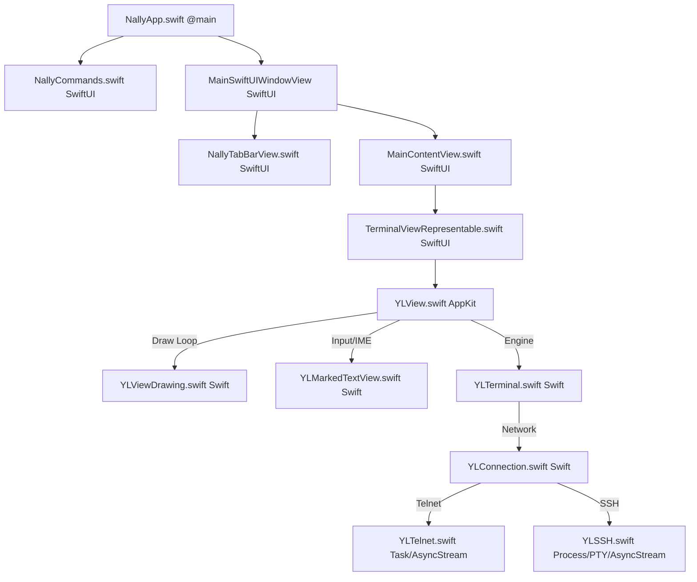

# Nally Unofficial 專案開發規格與架構說明書 (`NALLY_UNOFFICIAL_SPEC.md`)

## 1. 專案概述 (Project Overview)
Nally Unofficial 是一個開源的 macOS 終端機/BBS (Telnet/SSH) 用戶端程式。本專案的主要目標是將傳統基於 Objective-C、Nib/XIB 以及過時 Cocoa 繪圖與事件處理 API 的 Nally 移植至現代的 Apple Silicon (arm64) 架構，並逐步重構為基於 Swift 與 SwiftUI 的現代 macOS 應用程式。

目前主分支已成功完成 **Phase A 至 Phase C** 以及 **Option 1 ~ Option 3** 的全面升級，達成了 100% 純程式化與純 SwiftUI 生命週期、零 Interface Builder / Nib 依賴、完全淘汰外部 PSMTabBarControl 框架、以及 SSH/Telnet 網路傳輸層的全 Concurrency 化。

---

## 2. 核心架構設計 (Core Architecture)

本專案採用 **純正 SwiftUI 生命週期 + AppKit 終端機視圖橋接** 的混編架構：



### 2.1 進入點與生命週期管理
* **[NallyApp.swift](file:///Users/ericsk/Projects/Nally-Unofficial/Code/NallyApp.swift)**: 應用程式的主進入點（`@main`），採用純正的 SwiftUI `App` 生命週期。定義主 Window、Settings 視窗以及頂部指令選單，透過 `@NSApplicationDelegateAdaptor` 綁定 `NallyAppDelegate`。全域廣播監聽 `YLConnectionStateDidChangeNotification` 以進行多分頁與連線狀態指示燈的即時同步。
* **[NallyCommands.swift](file:///Users/ericsk/Projects/Nally-Unofficial/Code/NallyCommands.swift)**: 採用 SwiftUI 宣告式的 `.commands` 重寫全套系統頂部選單指令，包含連線、斷線 (`Cmd+D`)、新分頁 (`Cmd+T`)、關閉分頁 (`Cmd+W`)、重新連線 (`Cmd+R`)、分頁切換快捷鍵 (`Cmd+1~9` / `Cmd+}` / `Cmd+{`) 與編碼切換。
* **[NallyAppDelegate.swift](file:///Users/ericsk/Projects/Nally-Unofficial/Code/NallyAppDelegate.swift)**: 輕量化的 AppKit 代理，負責全域 `YLController` 實例管理與應用程式生命週期事件代理。

### 2.2 視圖與橋接層 (UI & Bridging Layer)
* **[NallyTabBarView](file:///Users/ericsk/Projects/Nally-Unofficial/Code/NallyApp.swift#L144)**: 純 SwiftUI 實作的頂部分頁列。支援滾動、獨立 `X` 關閉按鈕、`+` 新增分頁按鈕，以及依據連線狀態動態渲染連線中/斷線指示圖示。
* **[MainContentView.swift](file:///Users/ericsk/Projects/Nally-Unofficial/Code/MainContentView.swift)**: 終端機主要介面的 SwiftUI 封裝，依據全域字型與行列設定動態計算終端機所需尺寸，並顯示 `TerminalViewRepresentable`。
* **[PreferencesView.swift](file:///Users/ericsk/Projects/Nally-Unofficial/Code/PreferencesView.swift)**: 用 SwiftUI 重構的美化偏好設定視窗。具備 SF Symbols 視覺標頭、即時字型黑框預覽條、全顏色對照圓點標籤以及 URL Scheme (Telnet/SSH) 預設處理器設定。
* **[SitesView.swift](file:///Users/ericsk/Projects/Nally-Unofficial/Code/SitesView.swift)**: 用 SwiftUI 重構的美化站台管理器。具備動態通訊協定標籤 (`SSH` 藍色膠囊 / `TELNET` 青色膠囊)、經典標準 macOS 側邊欄控制列 (`+` / `-`) 與卡片式站台設定。
* **[TerminalViewRepresentable.swift](file:///Users/ericsk/Projects/Nally-Unofficial/Code/TerminalViewRepresentable.swift)**: 實作 `NSViewRepresentable`，負責將 AppKit 的終端機顯示元件 `YLView` 橋接至 SwiftUI 視圖階層中。
* **[YLView.swift](file:///Users/ericsk/Projects/Nally-Unofficial/Code/YLView.swift)**: 終端機主要視圖元件。已完全轉換為純 Swift 實作，消除 C++ / Objective-C++ 混編。負責滑鼠事件、鍵盤輸入、右鍵選單管理以及 conform `NSTextInputClient` 協定。
* **[YLMarkedTextView.swift](file:///Users/ericsk/Projects/Nally-Unofficial/Code/YLMarkedTextView.swift)**: 專責處理輸入法 (IME) Marked Text 的繪製，保證輸入法彈出視窗與中文字元組裝的相容性與穩定性。

### 2.3 終端機模擬與資料結構 (Terminal Engine & Core Data Models)
* **[YLTerminal.swift](file:///Users/ericsk/Projects/Nally-Unofficial/Code/YLTerminal.swift)**: 終端機模擬核心。用 Swift 重新實作，負責解析 VT100 / VT102 與 ANSI 跳脫序列（Escape Sequences），管理雙位元組字元緩衝區、游標位置以及更新狀態。
* **[CommonType.swift](file:///Users/ericsk/Projects/Nally-Unofficial/Code/CommonType.swift)**: 定義核心字元儲存結構 `cell` 及其對應的顯示屬性 `attribute` (如前景色、背景色、閃爍、粗體、雙位元組狀態等)。
* **[YLLGlobalConfig.swift](file:///Users/ericsk/Projects/Nally-Unofficial/Code/YLLGlobalConfig.swift)**: 使用現代 Swift 的 `@Observable` 機制重寫，管理全域設定、色彩對照表、CoreText 字型屬性（英文 Monaco / 中文 儷黑體等）。
* **[YLSite.swift](file:///Users/ericsk/Projects/Nally-Unofficial/Code/YLSite.swift)**: 使用 `@Observable` 的站台資料模型，包含站台名稱、連線位址、帳號密碼、預設編碼 (Big5/GBK) 及 ANSI 色彩鍵值設定。

### 2.4 網路通訊層 (Network Stack & Swift Concurrency)
* **[YLConnection.swift](file:///Users/ericsk/Projects/Nally-Unofficial/Code/YLConnection.swift)**: 網路通訊協定抽象介面與連線工廠。屬性 `connected` 採 Stored `@objc dynamic var` 配合 `didSet` 自動觸發 KVO 並透過 `YLConnectionStateDidChangeNotification` 全域發送狀態改變廣播。
* **[YLTelnet.swift](file:///Users/ericsk/Projects/Nally-Unofficial/Code/YLTelnet.swift)**: 採用 Swift Concurrency (`Task` / `AsyncStream<Data>`) 重構。徹底剔除舊式 `performSelector(afterDelay:)` 延遲與遞迴接收閉包，實現結構化非阻塞資料流接收與協定剖析。
* **[YLSSH.swift](file:///Users/ericsk/Projects/Nally-Unofficial/Code/YLSSH.swift)**: 採用 Swift Concurrency (`Task` / `AsyncStream<Data>`) 重構。利用 POSIX `posix_openpt` / `ptsname` 建立虛擬終端機 (PTY)，搭配 Foundation `Process` 執行系統 `/usr/bin/ssh`，實現非阻塞雙向讀寫與安全程序釋放。

### 2.5 繪圖與渲染引擎 (Rendering Engine)
* **[YLViewDrawing.swift](file:///Users/ericsk/Projects/Nally-Unofficial/Code/YLViewDrawing.swift)**: 透過 Swift 擴充 `YLView` 繪圖邏輯。使用 CoreGraphics / CoreText API 進行 GPU 加速字元渲染：
  * 解析 ANSI 色彩並套用對應的前景色與背景色。
  * 繪製 BBS 特殊框線與符號字元（如三角塊 `◢◣◤◥`、方塊等），採用自訂 Bezier 路徑填充。
  * 實作選取區 (Selection)、游標閃爍 (Blink) 與字型平滑化 (Font Smoothing)。

### 2.6 輔助功能與外掛系統 (Utilities & Plugins)
* **[YLController.swift](file:///Users/ericsk/Projects/Nally-Unofficial/Code/YLController.swift)**: App 主要控管元件，負責連結視窗選單、處理連線/斷線、切換分頁、管理站台名單以及同步分頁狀態。完美支援連線中分頁與視窗關閉前確認 (`ConfirmOnClose`) 邏輯，斷線狀態時自動免確認直接關閉。
* **[YLRun.swift](file:///Users/ericsk/Projects/Nally-Unofficial/Code/YLRun.swift) / [YLLine.swift](file:///Users/ericsk/Projects/Nally-Unofficial/Code/YLLine.swift) / [YLTextSuite.swift](file:///Users/ericsk/Projects/Nally-Unofficial/Code/YLTextSuite.swift)**: 負責剪貼簿文字貼上時的折行、中英文邊界處理及頭尾避開標點符號的邏輯。
* **[YLPluginLoader.swift](file:///Users/ericsk/Projects/Nally-Unofficial/Code/YLPluginLoader.swift)**: 負責動態載入 App 內置及 App Support 目錄下的外掛套件 (`.bundle`)。
* **[YLImagePreviewer.swift](file:///Users/ericsk/Projects/Nally-Unofficial/Code/YLImagePreviewer.swift) / [ImagePreviewerView.swift](file:///Users/ericsk/Projects/Nally-Unofficial/Code/ImagePreviewerView.swift)**: 用 SwiftUI 改寫的網址圖片下載與 HUD 懸浮預覽面板，具備非同步下載進度指示與 EXIF 資訊檢視。

---

## 3. 合併完成之優化階段 (Completed Stages)

專案目前的 master 分支包含了以下重大的現代化合併：

| 階段名稱 | 實作重點 | 涉及關鍵檔案 |
| :--- | :--- | :--- |
| **Phase 1: 資料模型** | 資料模型 Swift 化，引進 `@Observable` 監聽機制。 | [YLSite.swift](file:///Users/ericsk/Projects/Nally-Unofficial/Code/YLSite.swift), [YLLGlobalConfig.swift](file:///Users/ericsk/Projects/Nally-Unofficial/Code/YLLGlobalConfig.swift) |
| **Phase 2: 控制面版** | 偏好設定與站台設定視窗改寫為純 SwiftUI。 | [PreferencesView.swift](file:///Users/ericsk/Projects/Nally-Unofficial/Code/PreferencesView.swift), [SitesView.swift](file:///Users/ericsk/Projects/Nally-Unofficial/Code/SitesView.swift) |
| **Phase 3: 生命週期與工具列** | 移除 Nib 工具列，利用程式化 Delegate 與自訂 Toolbar 接管主視窗佈局。 | [NallyAppDelegate.swift](file:///Users/ericsk/Projects/Nally-Unofficial/Code/NallyAppDelegate.swift) |
| **Phase 4: 渲染與預覽機制** | CoreText GPU 渲染 Swift 化、 Marked Text 改寫，圖片預覽以 SwiftUI + HUD 重新實作。 | [YLViewDrawing.swift](file:///Users/ericsk/Projects/Nally-Unofficial/Code/YLViewDrawing.swift), [YLMarkedTextView.swift](file:///Users/ericsk/Projects/Nally-Unofficial/Code/YLMarkedTextView.swift), [YLImagePreviewer.swift](file:///Users/ericsk/Projects/Nally-Unofficial/Code/YLImagePreviewer.swift), [ImagePreviewerView.swift](file:///Users/ericsk/Projects/Nally-Unofficial/Code/ImagePreviewerView.swift) |
| **Phase 5: 模擬器與完全 Swift 化** | 重寫模擬器 core、Plugin 載入器，清除大批舊型 ObjC/C 檔案。 | [YLTerminal.swift](file:///Users/ericsk/Projects/Nally-Unofficial/Code/YLTerminal.swift), [YLPluginLoader.swift](file:///Users/ericsk/Projects/Nally-Unofficial/Code/YLPluginLoader.swift), [YLApplication.swift](file:///Users/ericsk/Projects/Nally-Unofficial/Code/YLApplication.swift) |
| **Phase 6: 視圖繪圖與外掛完全 Swift 化** | 將 `YLView` 視圖繪製與外掛完全改寫為 Swift，徹底清除 C++ / Objective-C++ 混編。 | [YLView.swift](file:///Users/ericsk/Projects/Nally-Unofficial/Code/YLView.swift), [YLBundle.swift](file:///Users/ericsk/Projects/Nally-Unofficial/Code/YLBundle.swift), [HelloNally.swift](file:///Users/ericsk/Projects/Nally-Unofficial/Plugins/HelloNally/HelloNally.swift), [ImagePreviewer.swift](file:///Users/ericsk/Projects/Nally-Unofficial/Plugins/ImagePreviewer/ImagePreviewer.swift) |
| **Swift 移植最終化 (100% Swift)** | 將 Keychain、編碼表、核心資料結構全面重寫為 Swift，完全移除所有 Objective-C/C 源碼。 | [YLKeychain.swift](file:///Users/ericsk/Projects/Nally-Unofficial/Code/YLKeychain.swift), [YLEncodingTable.swift](file:///Users/ericsk/Projects/Nally-Unofficial/Code/YLEncodingTable.swift), [CommonType.swift](file:///Users/ericsk/Projects/Nally-Unofficial/Code/CommonType.swift), [TextSuiteTests.swift](file:///Users/ericsk/Projects/Nally-Unofficial/Tests/TextSuiteTests.swift) |
| **Phase A: 全域設定與站台資料流** | 資料流與狀態管理現代化，改用原生 Swift 陣列 `[YLSite]`、Combine 宣告式訂閱與 `Codable` JSON 序列化。 | [YLSite.swift](file:///Users/ericsk/Projects/Nally-Unofficial/Code/YLSite.swift), [YLController.swift](file:///Users/ericsk/Projects/Nally-Unofficial/Code/YLController.swift) |
| **Phase B: SSH Concurrency 重構** | 淘汰 `forkpty` 與 `select()`，改用 POSIX PTY Master/Slave、Foundation `Process` 與 `Task` / `AsyncStream` 非阻塞讀寫。 | [YLSSH.swift](file:///Users/ericsk/Projects/Nally-Unofficial/Code/YLSSH.swift) |
| **Phase C: 視窗與選單純 SwiftUI 化** | 完全刪除 `MainMenu.xib` 與各語系 Nib 資源，採用 SwiftUI `.commands` 選單與純 `@main` 生命週期啟動。 | [NallyCommands.swift](file:///Users/ericsk/Projects/Nally-Unofficial/Code/NallyCommands.swift), [NallyApp.swift](file:///Users/ericsk/Projects/Nally-Unofficial/Code/NallyApp.swift) |
| **Option 1: PSMTabBarControl 移除** | 完全自專案檔 (`project.pbxproj`) 與硬碟移除 PSMTabBarControl.framework 與 NallyToolbarDelegate.swift 舊依賴。 | `Nally.xcodeproj`, [NallyAppDelegate.swift](file:///Users/ericsk/Projects/Nally-Unofficial/Code/NallyAppDelegate.swift) |
| **Option 2: 偏好設定與站台管理器 UI 現代化** | 重構 `PreferencesView` 與 `SitesView` 視覺設計，引入 SF Symbols、即時字型預覽、通訊協定膠囊標籤與標準 macOS 側邊欄控制按鈕。 | [PreferencesView.swift](file:///Users/ericsk/Projects/Nally-Unofficial/Code/PreferencesView.swift), [SitesView.swift](file:///Users/ericsk/Projects/Nally-Unofficial/Code/SitesView.swift) |
| **Option 3: YLTelnet Concurrency 重構** | 採用 `Task` 與 `AsyncStream<Data>` 重構 Telnet 讀取流，徹底剔除 `performSelector(afterDelay:)` 延遲。 | [YLTelnet.swift](file:///Users/ericsk/Projects/Nally-Unofficial/Code/YLTelnet.swift) |
| **Bugfix: 分頁與視窗關閉確認 & 多 Tab 指示燈同步** | 修復 `ConfirmOnClose` 預設值與代理綁定，實現無連線時免確認；透過 `YLConnectionStateDidChangeNotification` 實現多 Tab 連線狀態即時刷新。 | [YLController.swift](file:///Users/ericsk/Projects/Nally-Unofficial/Code/YLController.swift), [YLConnection.swift](file:///Users/ericsk/Projects/Nally-Unofficial/Code/YLConnection.swift), [NallyApp.swift](file:///Users/ericsk/Projects/Nally-Unofficial/Code/NallyApp.swift) |
| **BBS 繪圖與渲染引擎現代化 (CoreGraphics)** | 移除對 AppKit 隱式繪圖上下文狀態（如 `NSColor.set()` 與 `NSBezierPath`）的依賴，全面重構為純 `CGContext` 與 `CGPath` 原生繪圖調用。修復並調諧了 `isFlipped = true` 的 Flipped 視圖繪圖變換，達到 GPU 加速且執行緒安全的 CG 渲染。 | [YLViewDrawing.swift](file:///Users/ericsk/Projects/Nally-Unofficial/Code/YLViewDrawing.swift), [YLView.swift](file:///Users/ericsk/Projects/Nally-Unofficial/Code/YLView.swift) |
| **GPU Layer-Backed 與動畫圖層優化 (CALayer)** | 在 `YLView` 啟用 `wantsLayer = true` 與自訂 `layerContentsRedrawPolicy`，並為游標與選取區建立獨立的 `CALayer` 與 `CAShapeLayer` 硬體加速圖層。消除打字與選取反白時的 CPU 重繪，大幅降低 INP 延遲。 | [YLView.swift](file:///Users/ericsk/Projects/Nally-Unofficial/Code/YLView.swift) |
| **記憶體安全與 Terminal Core 平坦化 ＋ KVC 移除** | 重構 `YLTerminal` 終端機畫布至 Swift 二維陣列 `[[cell]]`，移除手動記憶體分配 `allocate`/`deallocate`；清除 `gSingleAdvance` 指標，並全面以型別安全屬性與 API 取代 KVC `setValue(forKey:)` 與 `performSelector`。 | [YLTerminal.swift](file:///Users/ericsk/Projects/Nally-Unofficial/Code/YLTerminal.swift), [NallyApp.swift](file:///Users/ericsk/Projects/Nally-Unofficial/Code/NallyApp.swift), [TerminalViewRepresentable.swift](file:///Users/ericsk/Projects/Nally-Unofficial/Code/TerminalViewRepresentable.swift) |
| **Swift 6 嚴格並行檢查與 `@MainActor` 整合** | 為 UI 管理器標註 `@MainActor`，將短網址請求重構為 async/await，全域啟用 `SWIFT_STRICT_CONCURRENCY = complete`。 | [YLContextualMenuManager.swift](file:///Users/ericsk/Projects/Nally-Unofficial/Code/YLContextualMenuManager.swift), [YLImagePreviewer.swift](file:///Users/ericsk/Projects/Nally-Unofficial/Code/YLImagePreviewer.swift) |
| **純 Terminal Canvas 視圖架構 (`NSTabView` 繼承解耦)** | 將 `YLView` 繼承由 AppKit `NSTabView` 重構為專屬 `NSView`，清除歷史邊框與 tabViewType Hack，封裝輕量化 `tabViewItems` 容器 API。 | [YLView.swift](file:///Users/ericsk/Projects/Nally-Unofficial/Code/YLView.swift), [NallyApp.swift](file:///Users/ericsk/Projects/Nally-Unofficial/Code/NallyApp.swift) |
| **App 佈景主題 (System/Light/Dark) 偏好設定** | 實作 `AppTheme` 列舉與 `applyTheme` 全域外觀切換介面，於 `PreferencesView` 提供即時免重啟切換並自動持久化記憶。 | [AppTheme.swift](file:///Users/ericsk/Projects/Nally-Unofficial/Code/AppTheme.swift), [PreferencesView.swift](file:///Users/ericsk/Projects/Nally-Unofficial/Code/PreferencesView.swift) |
| **現代 Swift Testing 自動化測試框架 (`import Testing`)** | 將單元測試框架全面升級至 Swift Testing，重構 Big5 斷字測試為 `@Test(arguments: ...)` 參數化案例，並新增 `TerminalGridTests` 與 `AppThemeTests`，支援 `make test` 命令行執行。 | [TextSuiteTests.swift](file:///Users/ericsk/Projects/Nally-Unofficial/Tests/TextSuiteTests.swift), [TerminalGridTests.swift](file:///Users/ericsk/Projects/Nally-Unofficial/Tests/TerminalGridTests.swift), [AppThemeTests.swift](file:///Users/ericsk/Projects/Nally-Unofficial/Tests/AppThemeTests.swift) |
| **SwiftData 站台數據層與現代 SwiftUI 雙欄側邊欄 (`NavigationSplitView`)** | 將 `YLSite` 升級為 SwiftData `@Model`，支援 `UserDefaults` 舊資料無縫自動遷移，重構 `SitesView` 支援關鍵字搜尋、`SSH`/`TELNET` 協定標籤與單元測試 `SiteDataTests`。 | [YLSite.swift](file:///Users/ericsk/Projects/Nally-Unofficial/Code/YLSite.swift), [SitesView.swift](file:///Users/ericsk/Projects/Nally-Unofficial/Code/SitesView.swift), [SiteDataTests.swift](file:///Users/ericsk/Projects/Nally-Unofficial/Tests/SiteDataTests.swift) |
| **macOS 14+ / 15+ 現代化 UI & UX (`MenuBarExtra` + Window Scene)** | 在頂端 Menu Bar 加入 `MenuBarExtra` 常駐一鍵快捷連線，提供「偏好設定」控制顯示開關，並全面整合原生 SwiftUI Window Scene 與鍵盤快捷鍵。 | [NallyApp.swift](file:///Users/ericsk/Projects/Nally-Unofficial/Code/NallyApp.swift), [PreferencesView.swift](file:///Users/ericsk/Projects/Nally-Unofficial/Code/PreferencesView.swift), [AppUIStateTests.swift](file:///Users/ericsk/Projects/Nally-Unofficial/Tests/AppUIStateTests.swift) |
| **SwiftUI 終端機分頁列 (`NallyTabBarView`) 原生化與拖曳重排** | 重構分頁列支援滑鼠 Drag & Drop 拖曳重排、Tab 右鍵選單 (Reconnect, Close, Close Others, Copy Address) 與背景訊息橙點提示燈。 | [NallyApp.swift](file:///Users/ericsk/Projects/Nally-Unofficial/Code/NallyApp.swift), [YLController.swift](file:///Users/ericsk/Projects/Nally-Unofficial/Code/YLController.swift), [TabReorderTests.swift](file:///Users/ericsk/Projects/Nally-Unofficial/Tests/TabReorderTests.swift) |

---

## 4. 建置與驗證方法 (Build & Validation)

### 4.1 自動編譯指令
本機端使用 `make` 或直接使用 `xcodebuild` 工具進行 Release 建置：
```bash
make
```
或
```bash
xcodebuild -scheme Nally -configuration Release SYMROOT=build build
```

### 4.2 系統手動測試重點 (Manual Verification Checklist)
1. **連線與多 Tab 操作**：點擊 `Cmd+N` 或 Toolbar 站台選單發起連線，新分頁與狀態指示燈應即時切換為連線中圖示 (`connect.pdf`)。
2. **連線與關閉確認**：
   * 在作用中連線按 `Cmd+W` 關閉 Tab 或點按視窗關閉按鈕，應跳出確認對話框；點選確定後關閉連線。
   * 在已斷線或無連線分頁下，應直接關閉、無須再次確認。
3. **字元渲染與 ANSI**：BBS 連線畫面中的雙位元組（中文字）、ANSI 彩色、特殊圖形符號（如三角塊 `◢◣◤◥`、方塊等）應正確對齊且無破圖。
4. **預覽功能**：滑鼠移至網址連結可顯示點按提示，點按後正確彈出 HUD 預覽，點按 `Esc` 可關閉。
5. **設定視窗與站台管理**：開啟偏好設定 (`Cmd+,`) 查看即時字型預覽與顏色面板；開啟站台管理器 (`Cmd+B`) 查看動態 `SSH`/`TELNET` 膠囊標籤與 `+`/`-` 經典側邊欄操作。

---

## 5. 未來持續開發目標 (Roadmap & Todo List)

- [x] **終端機主視圖完全 Swift 化**：將 [YLView.swift](file:///Users/ericsk/Projects/Nally-Unofficial/Code/YLView.swift) 完全改寫為純 Swift 實作，達成 100% Swift 核心專案目標。
- [x] **外掛（Plugins）模組重構**：將內建外掛 [HelloNally.swift](file:///Users/ericsk/Projects/Nally-Unofficial/Plugins/HelloNally/HelloNally.swift) 及 [ImagePreviewer.swift](file:///Users/ericsk/Projects/Nally-Unofficial/Plugins/ImagePreviewer/ImagePreviewer.swift) 完全改寫為 Swift，並整合 `YLBundle.swift` 作為統一的 Swift 外掛基類。
- [x] **原始碼 100% Swift 移植完成**：移除了專案中最後的 Objective-C 檔案與 C 橋接定義。
- [x] **現代網路協議優化與 Swift Concurrency**：將 `YLTelnet` 與 `YLSSH` 底層通訊完全以 Swift Concurrency (`Task` / `AsyncStream`) 重構。
- [x] **應用程式生命週期與工具列完全 SwiftUI 化**：淘汰 `MainMenu.xib` 載入邏輯，改由純 SwiftUI 宣告主視窗與 `.commands` 選單項目。
- [x] **淘汰 PSMTabBarControl 舊型分頁**：完全從專案與磁碟移除舊 Framework，改以純程式化與 SwiftUI `NallyTabBarView` 接管。
- [x] **設定視窗與站台管理器 UI 現代化**：重構 `PreferencesView` 與 `SitesView` 視覺設計，融入現代 macOS 質感與標準元件。
- [x] **BBS 繪圖與渲染引擎現代化**：全面改寫 `YLViewDrawing` 與 `YLView` 繪圖邏輯，採用純 `CGContext` 與 `CGPath` 原生 CoreGraphics API，提升繪圖效能與執行緒安全性。
- [x] **GPU Layer-Backed 與動畫圖層優化**：為游標與選取反白區重構為獨立的子圖層 (`CALayer`/`CAShapeLayer`) 合成渲染，消除打字與選取時的 CPU 重繪，優化互動流暢度。
- [x] **記憶體安全與 100% 強型別依賴注入**：終端機 Core 改用 Swift 原生二維陣列 `[[cell]]`，徹底淘汰原始 C 指標 (`UnsafeMutablePointer`)，並全面移除 KVC `setValue(forKey:)` 與 Selector 隱式呼叫。
- [x] **Swift 6 嚴格並行檢查與 `@MainActor` 整合**：全域啟用 `SWIFT_STRICT_CONCURRENCY = complete`，為 UI 管理類別標註 `@MainActor` 並將異步請求全面 Concurrency 化。
- [x] **純 Terminal Canvas 視圖架構**：將 `YLView` 繼承由 AppKit `NSTabView` 重構為專屬 `NSView`，清除歷史 Cocoa 邊框與內建 Tab 繪製，封裝輕量化 `tabViewItems` 容器 API。
- [x] **App 佈景主題 (System/Light/Dark) 偏好設定**：實作 `AppTheme` 列舉與 `applyTheme` 全域外觀切換介面，於 `PreferencesView` 提供即時免重啟切換並自動持久化記憶。
- [x] **現代 Swift Testing 自動化測試框架**：全面導入 Swift Testing (`import Testing`)，將 Big5 斷字測試改寫為 `@Test(arguments: ...)` 參數化案例，新增 Terminal 矩陣畫布與 Theme 測試集，整合 `make test` CLI 指令。
- [x] **SwiftData 站台數據層與現代 SwiftUI 雙欄側邊欄 (`NavigationSplitView`)**：將 `YLSite` 升級為 SwiftData `@Model`，支援舊資料無縫自動遷移，重構 `SitesView` 為搜尋/標籤側邊欄介面，新增 `SiteDataTests` 測試集。
- [x] **macOS 14+ / 15+ 現代化 UI & UX (`MenuBarExtra` + Window Scene)**：加入頂端 Menu Bar 常駐連線小工具與偏好設定開關，整合 SwiftUI Window Scene 與系統快捷鍵。
- [x] **SwiftUI 終端機分頁列 (`NallyTabBarView`) 原生化與拖曳重排**：重構分頁列支援 Drag & Drop 拖曳重排、Tab 右鍵選單、訊息指示燈與切換重繪修復。

---

本說明書作為 Nally Unofficial 專案未來持續開發的正式技術規格書與基準。
